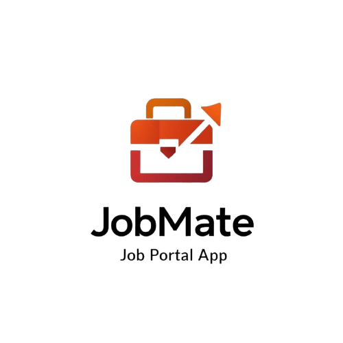

<!-- Logo -->

  

<!-- Title Banner -->

  

<h3 align="center">
  <b style="color:purple;">💼 Intelligent Job Portal for Modern Recruitment</b>
</h3>

<h3 align="center">
  <b>📱 Scalable Android Platform Connecting Talent with Opportunity</b>
</h3>

  
  
  
  
  
  

<!-- Overview -->

**JobMate** is a **production-ready Android Job Portal Application** designed to streamline and modernize the recruitment ecosystem by connecting job seekers and employers through a unified mobile platform.  

The application provides a **fast, scalable, and user-centric experience** for job discovery, job posting, and application management.  

Built with a **mobile-first architecture and powered by Firebase cloud services**, JobMate ensures **real-time data synchronization, secure authentication, and optimized performance**.  

The system reflects real-world software engineering practices, making it suitable for **practical deployment and industry-level use cases**.  

**Keywords:** Job portal, recruitment system, mobile application, Android, Firebase, employment platform.

<!-- Objectives -->

- 🎯 Design a **scalable and user-friendly job portal system**  
- 🔄 Simplify and optimize **job search and recruitment workflows**  
- 📊 Enable efficient **job posting, browsing, and application tracking**  
- 🤝 Create a **real-world, accessible recruitment platform**  

<!-- Features -->

- 🔐 **Secure Authentication System** (Firebase Authentication)  
- 📝 **Job Posting & Management Module** for employers  
- 📋 **Dynamic Job Listings Feed** with real-time updates  
- 🔍 **Advanced Job Search & Filtering System**  
- 📄 **Seamless Job Application Process**  
- 👤 **User Profile Creation & Management**  
- ✏️ **Profile Editing & Data Handling**  
- 📊 **Application Tracking System**  
- ⚡ **Real-time Data Synchronization (Firestore)**  
- 💾 **Local Data Storage & Caching (SQLite)** for improved performance  

<!-- Stakeholders -->

- 👨‍💼 Job Seekers  
- 🏢 Employers  
- 🏭 Companies  
- 📊 Recruitment Agencies  

<!-- Technology -->

- **Frontend:** Android (Java, XML UI)  
- **Backend:** Firebase Authentication  
- **Database:** Firestore (Cloud) + SQLite (Local Storage)  
- **Architecture:** Mobile Client–Cloud Backend Model  

<!-- Implementation -->

### 📱 Application Screens

- Splash Screen  
- Login Page  
- Registration Page  
- Home Dashboard  
- Job Listings Page  
- Search Jobs Interface  
- Post Job Page  
- Create Profile Page  
- Edit Profile Page  
- Application Tracking Page  
- Firebase Authentication Console  
- Firestore Database Console  

<!-- Future -->

- 🤖 AI-based Job Recommendation System  
- 💬 In-App Messaging & Communication  
- 🔔 Real-Time Notifications  
- 📅 Interview Scheduling & Integration  

<!-- Conclusion -->

**JobMate** provides a **complete, scalable, and industry-ready mobile recruitment solution** that simplifies both job searching and hiring processes.  

It demonstrates practical implementation of **modern Android development, cloud integration, real-time databases, and user-centric system design**, making it a strong **portfolio project for real-world software engineering roles**.  

The system is well-structured and extensible, with strong potential to evolve into a **fully intelligent recruitment platform**.

<!-- Author -->

### A. K. M. Masudur Rahman (Gaurab)  
🎓 Department of Computer Science and Engineering (CSE)  
🏫 Bangladesh Army University of Science and Technology (BAUST), Saidpur  
📧 Email: akmmasudurrahmangaurab@gmail.com  

<!-- Support -->

If you like this project, consider giving it a ⭐ on GitHub!
